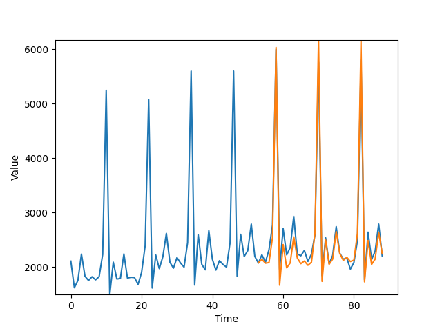
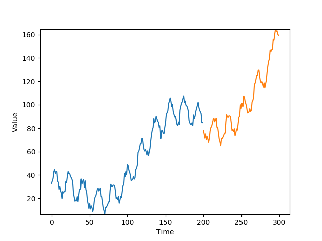
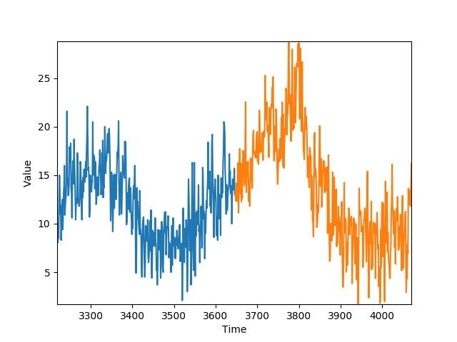

# AIprojects
Projects for Artificial Intelligence university exam

## Temporal series prediction
Data points represents jewellery sales over the months (December shows high sales due to christmas).
The projection in orange is made over the testset after some wind-up data points.

Other examples:

